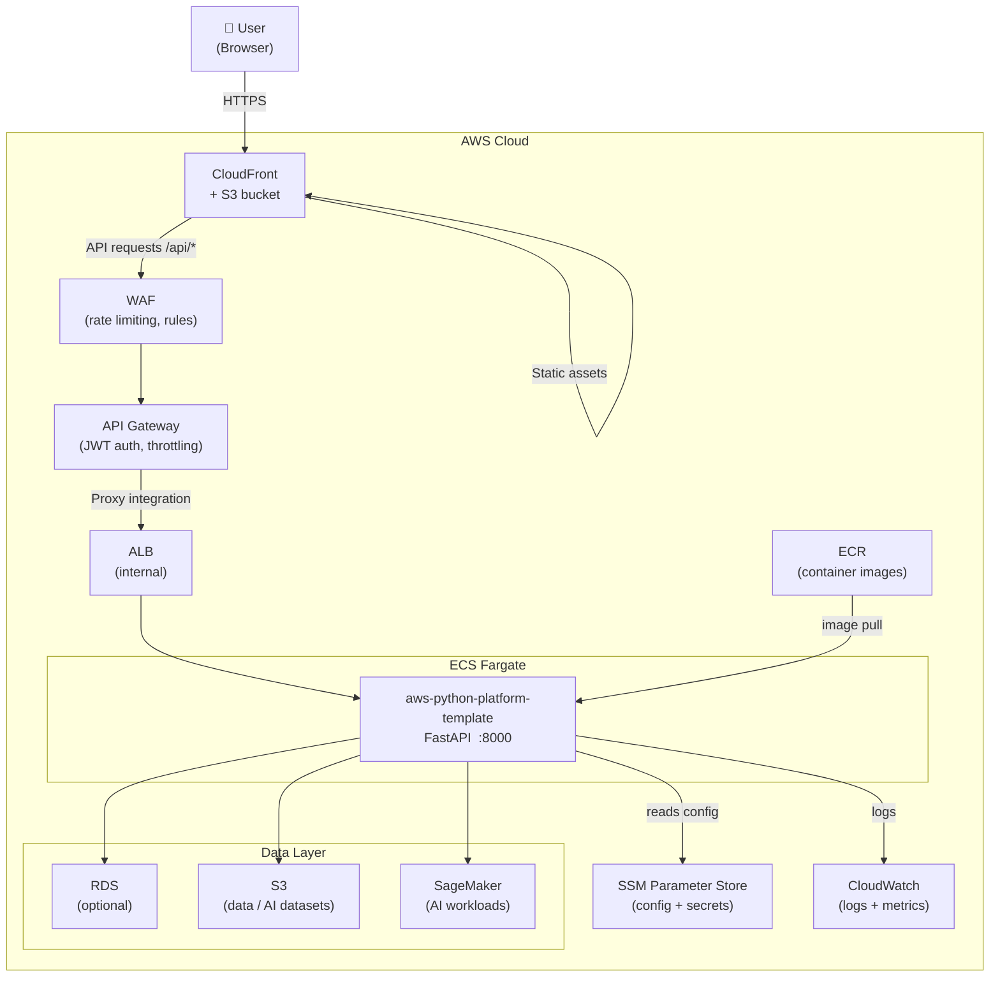
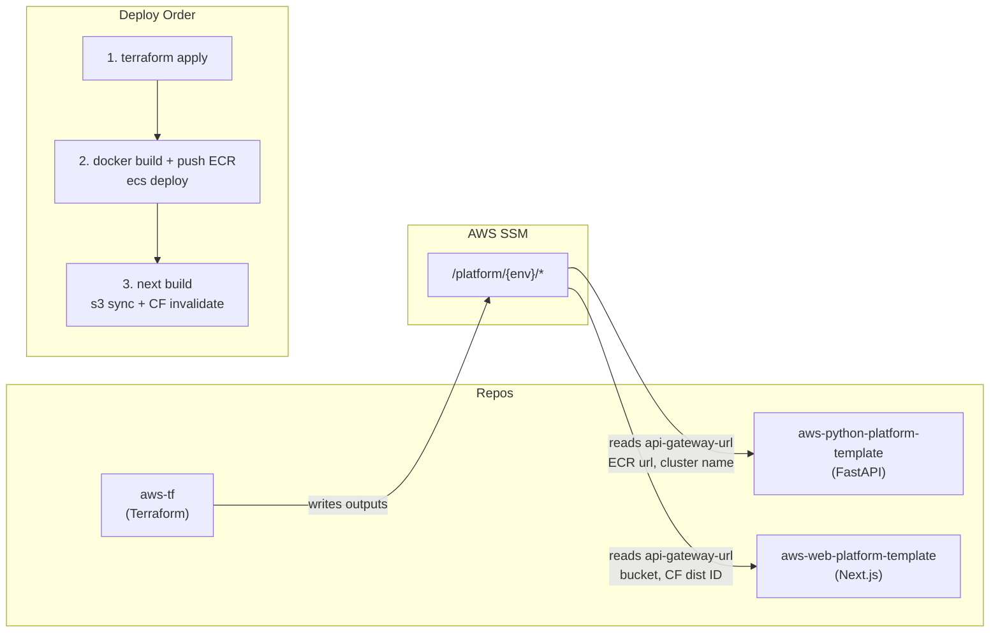
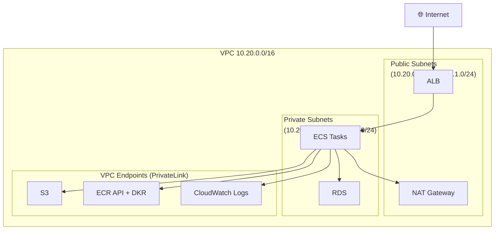
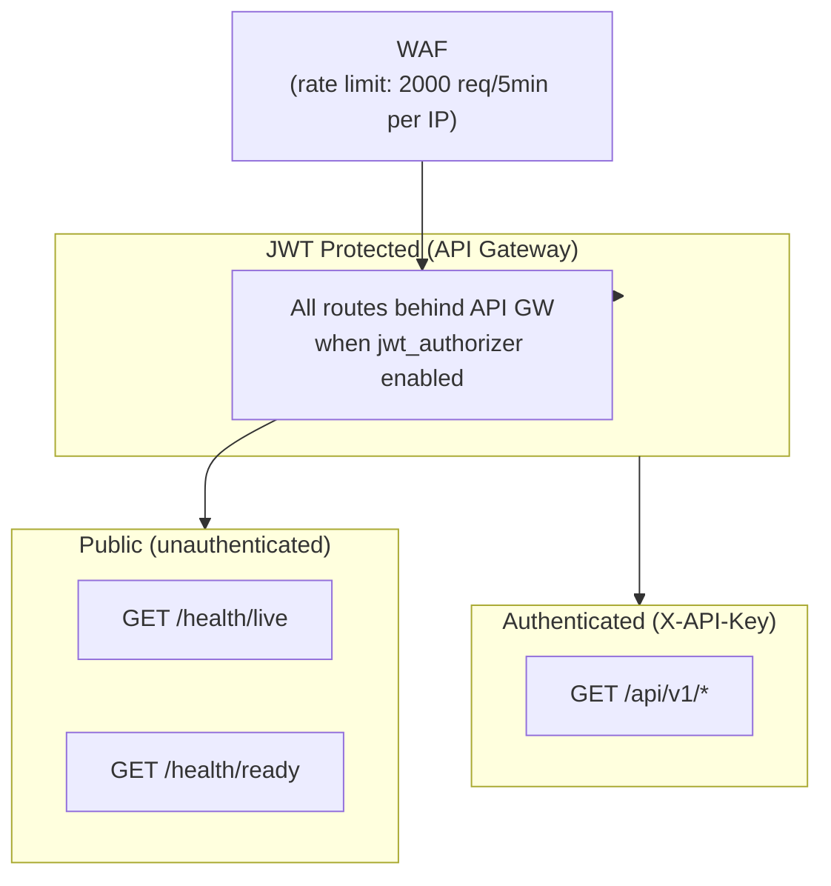
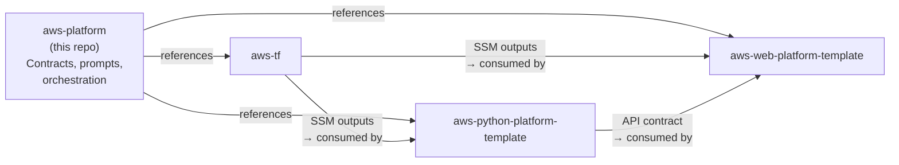

# Platform Architecture Diagrams

## System Overview

```mermaid
flowchart TD
    User["👤 User\n(Browser)"]

    subgraph AWS["AWS Cloud"]
        CF["CloudFront\n+ S3 bucket"]
        WAF["WAF\n(rate limiting, rules)"]
        APIGW["API Gateway\n(JWT auth, throttling)"]
        ALB["ALB\n(internal)"]

        subgraph ECS["ECS Fargate"]
            APP["aws-python-platform-template\nFastAPI  :8000"]
        end

        subgraph Data["Data Layer"]
            RDS["RDS\n(optional)"]
            S3Data["S3\n(data / AI datasets)"]
            SM["SageMaker\n(AI workloads)"]
        end

        SSM["SSM Parameter Store\n(config + secrets)"]
        CW["CloudWatch\n(logs + metrics)"]
        ECR["ECR\n(container images)"]
    end

    User -->|"HTTPS"| CF
    CF -->|"Static assets"| CF
    CF -->|"API requests /api/*"| WAF
    WAF --> APIGW
    APIGW -->|"Proxy integration"| ALB
    ALB --> APP

    APP -->|"reads config"| SSM
    APP -->|"logs"| CW
    APP --> RDS
    APP --> S3Data
    APP --> SM

    ECR -->|"image pull"| APP
```

---

## Deployment Pipeline

```mermaid
flowchart LR
    subgraph Repos
        TF["aws-tf\n(Terraform)"]
        PY["aws-python-platform-template\n(FastAPI)"]
        WEB["aws-web-platform-template\n(Next.js)"]
    end

    subgraph "AWS SSM"
        SSM["/platform/{env}/*"]
    end

    subgraph "Deploy Order"
        D1["1. terraform apply"]
        D2["2. docker build + push ECR\necs deploy"]
        D3["3. next build\ns3 sync + CF invalidate"]
    end

    TF -->|"writes outputs"| SSM
    SSM -->|"reads api-gateway-url\nECR url, cluster name"| PY
    SSM -->|"reads api-gateway-url\nbucket, CF dist ID"| WEB

    D1 --> D2 --> D3
```

---

## Network Architecture

```mermaid
flowchart TB
    Internet["🌐 Internet"]

    subgraph VPC["VPC  10.20.0.0/16"]
        subgraph Public["Public Subnets\n(10.20.0.0/24, 10.20.1.0/24)"]
            NAT["NAT Gateway"]
            ALB["ALB"]
        end

        subgraph Private["Private Subnets\n(10.20.10.0/24, 10.20.11.0/24)"]
            ECS["ECS Tasks"]
            RDS["RDS"]
        end

        subgraph Endpoints["VPC Endpoints (PrivateLink)"]
            EP_S3["S3"]
            EP_ECR["ECR API + DKR"]
            EP_CW["CloudWatch Logs"]
        end
    end

    Internet --> ALB
    ALB --> ECS
    ECS --> NAT
    ECS --> EP_S3
    ECS --> EP_ECR
    ECS --> EP_CW
    ECS --> RDS
```

---

## Security Boundaries

```mermaid
flowchart TD
    subgraph Public["Public (unauthenticated)"]
        LIVE["GET /health/live"]
        READY["GET /health/ready"]
    end

    subgraph Authenticated["Authenticated (X-API-Key)"]
        V1["GET /api/v1/*"]
    end

    subgraph JWT["JWT Protected (API Gateway)"]
        GW["All routes behind API GW\nwhen jwt_authorizer enabled"]
    end

    WAF["WAF\n(rate limit: 2000 req/5min per IP)"] --> GW
    GW --> Public
    GW --> JWT
    JWT --> Authenticated
```

---

## Repo Dependency Map

```mermaid
flowchart LR
    META["aws-platform\n(this repo)\nContracts, prompts,\norchestration"]
    TF["aws-tf"]
    PY["aws-python-platform-template"]
    WEB["aws-web-platform-template"]

    META -->|"references"| TF
    META -->|"references"| PY
    META -->|"references"| WEB
    TF -->|"SSM outputs\n→ consumed by"| PY
    TF -->|"SSM outputs\n→ consumed by"| WEB
    PY -->|"API contract\n→ consumed by"| WEB
```
